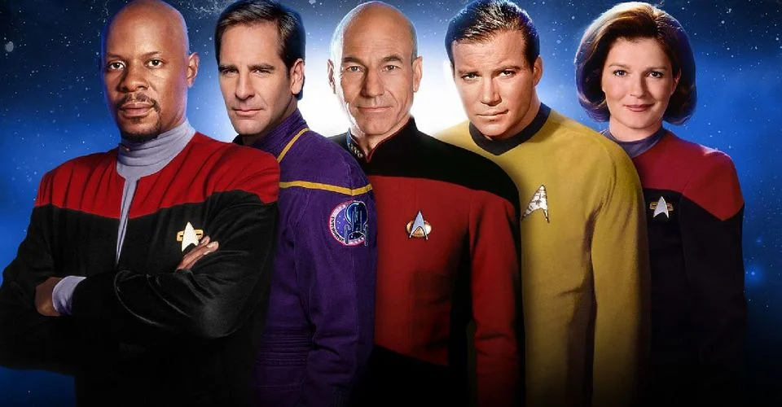

# Star Trek Captains - an NLP inquiry

<a href="https://screenrant.com/every-star-trek-captain-ranked/">Picture Source</a>

The five great Star Trek captains (from left to right): Benjamin Sisko, Jonathan Archer, Jean-Luc Picard, James T. Kirk and Kathryn Janeway. They all were at the center of their own television series and their lines are quoted for their insight and wisdom. 

The avid Trekkie will recognize quite a few of the most famous quotes, and some lines simply by the unique style of each captain, but can a machine learning model do the same? Will the model even be better than a human at recognizing which of these five captains said a specific line?

And is the model better than you? You can find out here: trek.jani.codes

This project was conducted as the final Capstone in the 3-month Data Science Immersive at General Assembly. 

_______

## Captain’s log 
- [Cargo Bay Inventory](#cargo) 
- [The Mission](#the_mission)
- [Preflight Check](#preflight_check)
- [Subspace Scan](#subspace_scan)
- [Removing interference](#removing_interference)
- [Level 5 diagnostic](#level_5_diagnostic)
- [Feature Engineering](#feature_engineering)
- [Preliminary Modelling](#preliminary_modelling)
- [XGBoost](#xgboost)
- [Minigame](#minigame)
- [Report](#report)
- [Boldly go](#boldly_go)
- [Key lessons learned](#key_lessons_learned)
- [Tricorder upgrades](#tricorder_upgrades)
- [Hailing Frequency](#hailing_frequency)

_______

### Cargo Bay Inventory
- README.md
- LICENSE (GNU Affero General Public License v3.0)
- star_trek_captains.ipynb 
    - trek.jani.codes
    - index.html
    - index.js
    - main.py
- style.css
- presentation_star_trek_captains.pptx
_____________

### The Mission

This project does not solve any real world problem. But it provided a great opportunity to learn and use several NLP techniques, was a lot of fun and a minigame was born out of it!

Starting from all lines each of the five famous captains said I set out to build and refine classification models to predict which of the captains a specific quote can be attributed to.

Since - for the purpose of this project - all captains are equally important, the success metric used was the overall accuracy of the model. The baseline accuracy, meaning the proportion of the majority class (Captain Picard) was 0.25. 
_______________

### Preflight Check

Star Trek is a vast franchise with a multitude of television series, books and movies. It all started in 1966 with the release of Star Trek (later retroactively named “Star Trek: The Original Series”), featuring the first appearances of well-known characters such as Captain Kirk or Spock. Since then many series taking place in the Star Trek universe have been produced, with five live-action series centering around one captain, therefore producing a sizable amount of lines of dialog to investigate.

These were the five series I decided to focus on and their respective abbreviation, which will be used later in the text to refer to them:
- Star Trek: The Original Series (TOS)
- Star Trek: The Next Generation (TNG)
- Star Trek: Deep Space Nine (DS9)
- Star Trek: Voyager (VOY)
- Star Trek: Enterprise (ENT)

In each of those series there is one central captain:
- TOS: James T. Kirk 
- TNG: Jean-Luc Picard 
- DS9: Benjamin Sisko 
- VOY: Kathryn Janeway 
- ENT: Jonathan Archer 

A technical note:
All lines of these captains were included, disregarding whether they were said in the original series the captain belongs to or in a crossover episode. Lines from mirror/alternate universe characters were counted with their prime-universe characters. Lines said over communication devices were counted. Personal and captain's logs were not counted unless they were unequivocally identified as belonging to a specific character. 
____________

### Subspace Scan

The raw scripts of all episodes from the five series were scraped from chakoteya.net using BeautifulSoup. A table containing the episode title, stardate (the calendar system much of the Star Trek franchise uses), original airdate (Gregorian calendar), production number as well as the full script of the episode for each series was created (Figure 1). I made the scraped data available as csvs on Kaggle. 

 
Figure 1. Organization of the scraped data. The example shows the first 5 episodes of the Voyager series.
_____________

### Removing Interference

The column of interest in figure 1 was the script column, containing a list of whole-episode scripts in the form of a string. The first step in getting the data into a clean line-by-line form was to find the character speaking (written in all caps) and their respective line. 

A line simply is all text spoken until the next character speaks or the episode ends, it can range from one word to containing a whole paragraph of text.

The caveat was that sometimes a character was speaking over the comm-system which was signified by “[OC]” behind the character name and Captain’s - and Private logs were often not declared in all caps. Additionally one character’s name (to be precise, several characters of an omnipotent collective species) consists only of one capital letter “Q” which meant that in that case the colon behind the name had to be used to differentiate being Q speaking and Q simply being mentioned by another character.

Regex was used to collect both the names of the characters speaking and the lines spoken (Figure 2). 

Figure 2. The regex used to find characters and their lines. A full breakdown and explanation of this regex can be found in the Jupyter Notebook. 

Additionally the lines collected still contained some information that was not spoken by the characters themselves, such as stage directions, for example: `(The main door slams shut behind them.)`, which were always in between smooth parentheses. Additionally characters in mirror universes/clones etc were designated with `OTHER`, which the line separation regex cut off into the previous line. Locations were specified within squared brackets, e.g. `[BRIDGE]`. Lastly names with prefixes, for example `T'Pol` had their prefix cut off into the previous line, which in some cases could constitute data leakage (for example, since T'Pol only exists in ENT, the `T'`at the end of a line would be a clear predictor for Archer having said that line). 

All of these artefacts were removed using regex. 
______________

### Level 5 Diagnostic

Initial EDA quickly showed that all captains sometimes did not need many words to get what they want. Since a line simply consisting of “Yes.” is not classifiable, neither by human nor model the decision was made to only analyze lines with at least 5 words and at least 20 characters. 

This approach resulted in 35552 lines in total. The five classes were nicely balanced with the majority of the lines (8888 or 25%) having been said by Captain Picard (Figure 3). 

Figure 3. Class Balance.

After removing lines with less than 5 words there still remained a notable difference in how many words each captain used on average with Janeway having the longest average line at 12.57 words and Archer being more curt at an average of 10.63 words per line (Figure 4). 

Figure 4. Average word count per line of each captain. Overall the average line consisted of 11.6 words. 

A simple wordcount using CountVectorizer from scikit-learn was used to determine the most common words per captain (excluding english stopwords). The result was visualized with word clouds using the WordCloud package and pictures of the captains (Figure 5).

Figure 5. Word clouds of all captains. Top row left to right: Janeway, Picard, Archer. Bottom row left to right: Kirk, Sisko.
_____________

### Feature Engineering

Due to this being a pure NLP project, the line said was the only data from which a prediction could be made, therefore all used features had to be engineered from the line itself. 

Both CountVectorizer and TfidfVectorizer from scikit-learn were used to get counts of words in each line in a bag-of-words approach. 

The number of words in each line was also extracted into a separate feature for prediction, since notable differences in the average number of words per line between captains were discovered during EDA. 

Additionally part-of-speech tagging was done using the NLTK package (Figure 6) to extract both grammatical features and punctuation.

Figure 6. Example of part-of-speech tagging. WP: Wh-pronoun, VBP: verb (non-3rd-person singular present), PRP: personal pronoun, VB: verb (base form), NNP: proper noun (singular). 

Lastly the pre-trained word embeddings from GloVe’s wikipedia crawl and a custom function was used to calculate the average 300-dimensional embedding of each line (Figure 7). 

(For fun the 50-dimensional embeddings were used to find the average word each captain said using all words in all their lines. It was the same for every captain: “supposed”). 

Figure 7. Function to find the average embedding of all words in a line using GloVe pre-trained embedding vectors. 

In summary the following features were engineered from each line resulting in 9125 predictors:
Bag-of-word word counts 
part-of-speech tagging
number of words in the line
average embedding of all words in a line using the pretrained 300-dimensional GloVe-Embeddings
__________________

### Preliminary modelling

Seven preliminary models were tested on only the bag-of-word approach comparing CountVectorizer (Cvec) and TfidfVectorizer (Tfidf). While all models performed better than baseline, the highest accuracy achieved was 0.377 with a Multinomial Naive Bayes model, followed closely by Logistic Regression scoring 0.376 (Figure 8). There was little difference between the results obtained by using the two different vectorizers, while CountVectorizer seemed to fare slightly better, hence it was used moving forward.

Figure 8. Test Accuracy Scores for bag-of-words models. 

A sanity check was performed by evaluating the coefficients of the Logistic Regression model in combination with TfidfVectorizer picked to predict for each captain. The example in figure 9 shows the top predictors for each captain, which to a Trekkie mostly make perfect sense.  Sanity check passed!

Figure 9. Top coefficients in the Logistic Regression (bag-of-words approach) for each of the captains.
__________________

### XGBoost

To obtain the best possible accuracy XGBoost was used on different weak Decision Trees. The model performing best was a combined approach of bagging and boosting using a RandomForestClassifier with 7 Decision Trees at a max depth of 3. 

There was residual overfitting as shown in figure 10. 

Figure 10. mlogloss of the train and test set over 500 epochs. 

The XGBoost model reached an overall accuracy of 0.4756 which was a sizable improvement from baseline (0.25). In the confusion matrix in figure 11 one can see that for each true label the most commonly predicted class was the correct one. If predicted wrongly the answer was most often Picard, which makes sense, with Picard being the majority class. The exception to this were lines by Archer which - if mislabeled - most often got predicted as having been said by Janeway. 

Figure 11. Confusion matrix for the XGBoost model with the greatest accuracy. 
______________

### Minigame

In order to make the model accessible to anyone a website (Figure 12) was created from scratch using HTML and CSS on the frontend and JavaScript on the backend. A custom API that serves individual lines as well as the model’s guess and the correct answer for the line was created using the FastAPI package for Python. 

Figure 12. Screenshot from the minigame website. 
_______________

### Report

This project led to the successful creation of a captain-classification model that is not easy to beat by a casual Trekkie (at least I have only won twice against it, so far). Features that were engineered additionally to the bag-of-word approach such as part-of-speech tagging and word embeddings improved the accuracy of the model greatly, as did using an XGBoost model. 
_______________

### Boldly go

This project could be taken further by returning hyperparameters to prevent overfitting of the XGBoost model, as well as implementing other advanced models such as Neural Nets.  

Furthermore the data that was collected contains all lines for all characters of these series which leads to a wide range of possible classifiers for example to distinguish between captains and other officers or between lines of characters with different shirt colors. 
_______________

### Key lessons learned

This project taught me a great deal about how to use different NLP-tools and seek out packages on my own to implement my ideas. Additionally I was able to successfully run my first XGBoost model and it did not disappoint. 

Looking back at my code now I have a similar reaction as to everything I’ve written in the past: looks ok, but I could do it way better now. Which is my goal at the end of every project. 

Also: setting up a website correctly including an https-protocol and custom API is harder than learning JavaScript on the go. 
________________

### Tricorder upgrades
- Pandas
- NumPy
- BeautifulSoup
- re
- NLTK
- scikit-learn
- XGBoost
- Matplotlib
- seaborn
- WordCloud
- NetworkX
_______________

### Hailing Frequency

You can contact me on <a href="https://www.linkedin.com/in/tamara-janina-fingerlin/">linkedin</a> or <a href="https://twitter.com/tjanifdata">twitter</a>. 

